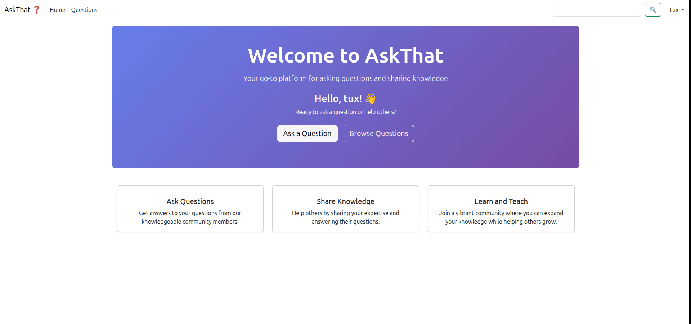

# AskThat

AskThat is a question and answer platform project developed in ASP.NET Core that I've been coding with help from AI tools while trying to follow clean architecture principles.

# Install and Run

Requirements: Dotnet 9, MSSQL

```
$ git clone https://github.com/th-103/AskThat
$ cd AskThat
$ dotnet restore
$ cd src
$ dotnet ef database update --project AskThat.Infrastructure --startup-project AskThat.Web
$ dotnet build AskThat.Web
$ dotnet run --project AskThat.Web

```

# Screenshoots


